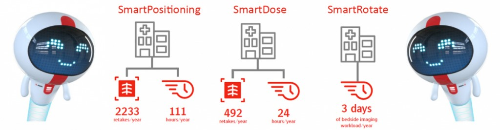
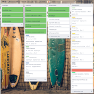
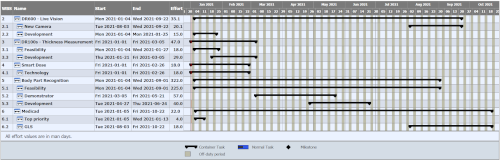
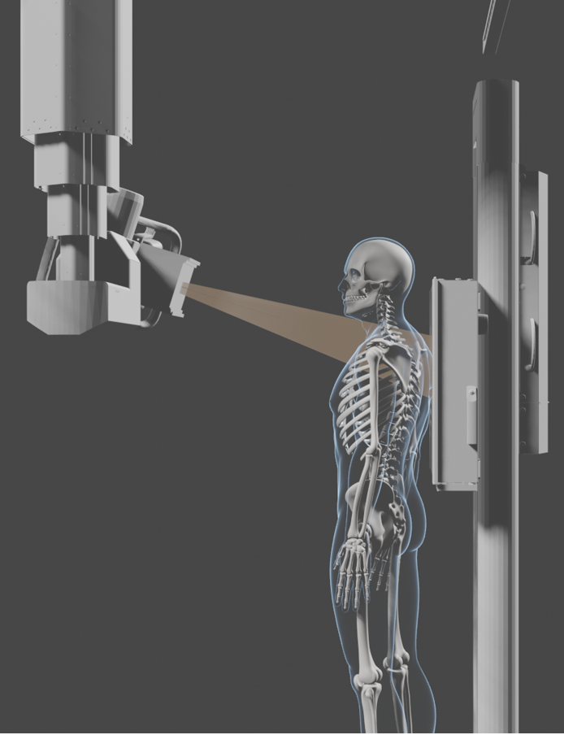
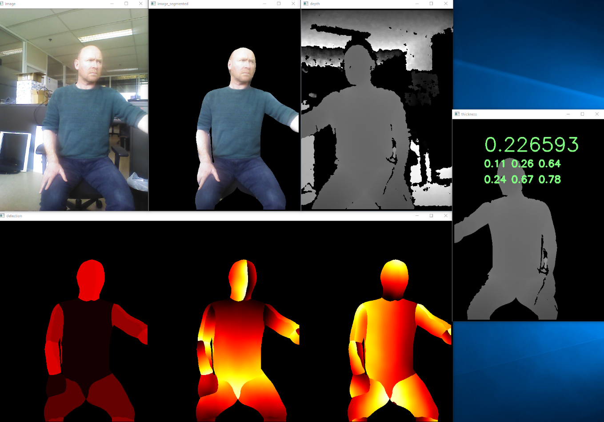
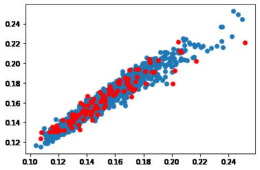
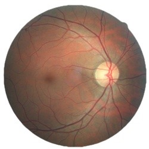

# Portfolio

## SmartXR
Technology innovation project for automatic patient thickness measurement and augmented reality with depth cameras. Optimising workflow with the aid of intelligent sensors and artificial intelligence: [SmartAlign](https://www.youtube.com/watch?v=9JK6VvTmHKw&list=PLZUHziR7BH05hZpypM6EbExV5jlN15Dge&index=3&ab_channel=AgfaRadiologySolutions), [SmartDose](https://www.youtube.com/watch?v=hFiWwWdyD-8&list=PLZUHziR7BH05hZpypM6EbExV5jlN15Dge&index=4&ab_channel=AgfaRadiologySolutions), [SmartRotate](https://www.youtube.com/watch?v=qIXslnTsih4&list=PLZUHziR7BH05hZpypM6EbExV5jlN15Dge&index=5&ab_channel=AgfaRadiologySolutions), [SmartPositioning](https://www.youtube.com/watch?v=CkWlYKfAxLE&list=PLZUHziR7BH05hZpypM6EbExV5jlN15Dge&ab_channel=AgfaRadiologySolutions). 

 
### Task
The main goal of this project is to assist the radiographers in their workflow while taking X-Ray images. Because the experience of the radiographers has reduced the last decades, I saw the opportunity for Agfa to implement a program to raise the knowledge bar and assist the radiographers in their daily work with [SmartXR](https://medimg.agfa.com/main/direct-radiography/smartxr/).

### Action
After a prioritization round, the first four pillars for SmartXR were determined. This included the estimation of risk, effort and value from a large set of features. Collaboration with universities for the different topics were set up, work was divided across multiple teams and development followed up. With custom trello scripts, overview gantt charts are created combining all phases, steps and projects.

   

### Result
The result of this project was one of the largest successful product launches of Agfa. The project is now the core of new features being implemented to further assist and automate the workflow of the radiographer. 

### Responsibilities
Project Planning, Software Architect, Researcher

## Deep learning projects

### Thickness estimation

This is a feasibility project at Agfa where the chest thickness of a patient is estimated from an image taken with a depth camera. Because data collection of patients since the introduction of the 
[GDPR](https://en.wikipedia.org/wiki/General_Data_Protection_Regulation) 
is very difficult, the deep learning model training set was simulated with virtual patients, generated by 
[makehuman](http://www.makehumancommunity.org/) and 
[blender](https://www.blender.org/). 
The inputs to the 
[EfficientNet](https://arxiv.org/abs/1905.11946) 
network are the depth maps, distances from the camera to the patient, segmented by the 
[DensePose](http://densepose.org/) network and the thickness maps, thickness of the patient along the X-ray path. Both maps were generated by blender. In order to obtain the thickness of the patient, the average of the estimated thickness maps across the chest region was computed and used as the chest thickness. In the graph, the blue dots are the distribution of the thickness estimations of the training data and the red dots the predicted result of unseen virtual patients. While transferring these virtual results to reality, the DensePose network was not stable enough to be used at the SIDs (Source to Image Distance) which are typical for mobile chest X-rays. 

### Blindness detection

In order to check my skills for deep learning, I participated in the [APTOS 2019 Blindness Detection competition](https://www.kaggle.com/c/aptos2019-blindness-detection/overview). I ended at place 319 out of 2928 teams in the private leaderboard, where the algorithm is tested on unseen data. Provided that I had more time – it was summer-holiday – and more computing power to also include the data from a [previous competition](https://www.kaggle.com/c/diabetic-retinopathy-detection), I think I could have ended in the top 100. 

### Responsibilities
Software Architect, Team Coach
